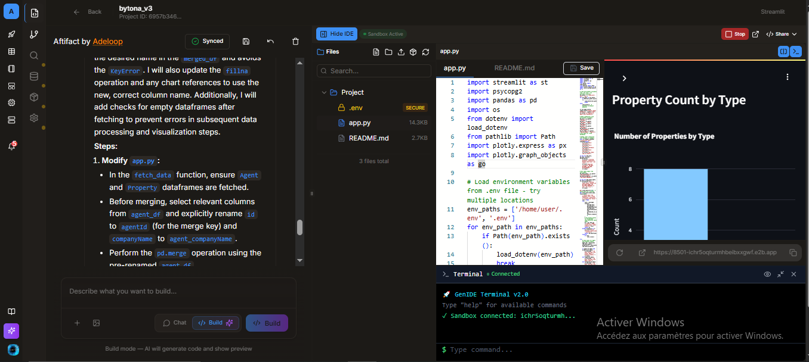
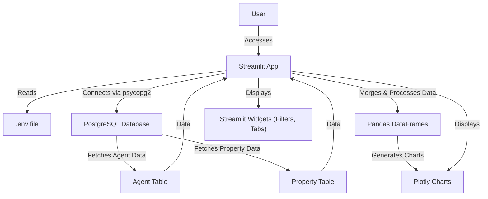

# Property & Agent Data Dashboard



This Streamlit application provides an interactive dashboard to visualize and analyze data from 'Agent' and 'Property' tables in a PostgreSQL database. It leverages Plotly for rich visualizations and Streamlit's interactive components for filtering and exploration.

## Features

*   **Secure Database Connection:** Connects to PostgreSQL using credentials from a `.env` file.
*   **Data Fetching:** Retrieves data from `Agent` and `Property` tables.
*   **Data Merging:** Joins property data with agent data to analyze relationships.
*   **Interactive Filters:** Filter data by property type, city, and agent company.
*   **Plotly Visualizations:**
    *   **Property Overview:** Property count by type, average price by type, price distribution, area vs. price scatter plot.
    *   **Agent Performance:** Number of properties per agent company, total value of properties per agent company, average property price per agent company.
    *   **Location Analysis:** Properties by city, average price by city, and a map visualization of property locations (if coordinates are available).
*   **Raw Data View:** Tabs to inspect the raw Agent, Property, and Merged DataFrames.

## Architecture Diagram



## Setup and Run

### 1. Environment Variables

Create a `.env` file in the root directory of the project with the following content. **Replace placeholder values with your actual database credentials and table names.**


### 2. Install Dependencies

Ensure you have Python installed. Then, install the required libraries:

```bash
pip install streamlit pandas psycopg2-binary python-dotenv plotly
```

### 3. Run the Application

Navigate to the project directory in your terminal and run:

```bash
streamlit run app.py
```

The application will open in your web browser, typically at `http://localhost:8501`.
